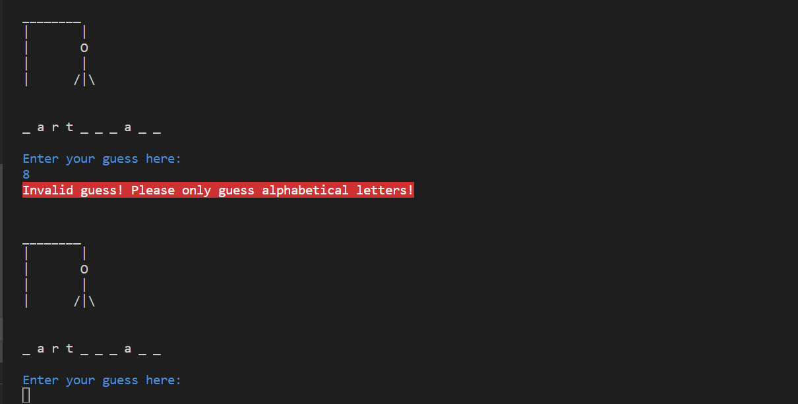
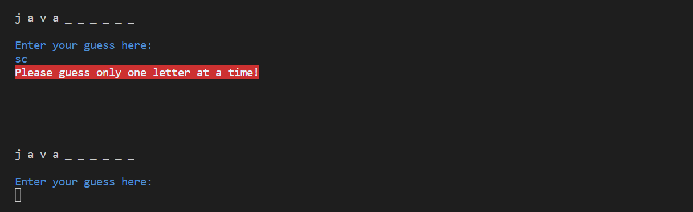

# Hangman

Hangman is a Python terminal game which runs in the Code Institute mock terminal on Heroku.

Users have to guess the secret word generated by the computer before the stick man is fully formed. Users can choose a level for easy, medium or hard words.

[You can view the live version of my project here](https://hangman-kk.herokuapp.com/)


---

## How to Play

Originally, Hangman is a two-player pen and paper game where one player thinks of a word and the other player has to guess it by suggesting one letter at a time within a certain number of guesses. You can read more about it on [Wikipedia](https://en.wikipedia.org/wiki/Hangman_(game)).

In this version, the player chooses a difficulty level at the start of the game; easy, medium or hard, and the computer generates a random secret word from the chosen level for the user to guess, with dashes representing the letters of that word.

When a player guesses a letter correctly, it will show up as many times as it appears in the word. 
To win the game, players have to guess the secret word before the hangman is fully formed.

If a player guesses incorrectly, part of the hangman will be drawn. Players will have six wrong attempts to guess the word and on the seventh the hangman will be fully formed and the player loses.

---

## Features

### Existing Features

- Enter name, welcome and game options


- Option to read full game rules


- Choose difficulty


- Random word generation
  - Word is hidden from player and dashes are shown for each letter in the word


- Input validation and error checking
  - You cannot guess a number or special character

  

  - You cannot guess multiple letters at a time

  

  - You cannot guess the same letter twice 
  
  

### Future Features

- Add a timer so players have a specific amount of time to guess the word in
  - Amount of time would decrease for higher difficulty levels

- Add a high score feature to record players scores

---

## Data Model

I used the Hangman game class for my data model. This contains the functions for the game to be played by requesting a guess from the player, validating that the user hasn't guessed a digit instead of a letter, more than one letter, or a letter they have already guessed, tracking player progress and drawing the hangman. There is also a function to offer players the option to replay once the game is over.

```python
class Hangman():
    """
    Game class with methods
    """
    def __init__(self, secret_word):
        self.wrong_guess = 0
        self.secret_word = secret_word
        self.progress = list('_' * len(self.secret_word))
```

There are also a number of helper methods included in the class:
- ```find_secret_word_letters()```
- ```invalid_input_digit()```
- ```invalid_input_len()```
- ```print_game_status()```
- ```update_progress()```
- ```get_user_input()```
- ```get_user_input()```
- ```play()```

---

## Tools & Technologies

- Python for 
- OS for
- Time for
- Random for 
- Colorama for 

---

## Testing

For all testing please refer to the [TESTING.md](TESTING.md) file.

---

## Deployment

Code Institute has provided a [template](https://github.com/Code-Institute-Org/python-essentials-template) to display the terminal view of this backend application in a modern web browser. This is to improve the accessibility of the project to others.

The live deployed application can be found deployed on [Heroku](https://hangman-kk.herokuapp.com/).

### Local Deployment

*Gitpod* IDE was used to write the code for this project.

You can clone the repository by following these steps:

1. Go to the [GitHub repository](https://github.com/katkapsasky/hangman) 
2. Locate the Code button above the list of files and click it 
3. Select if you prefer to clone using HTTPS, SSH, or GitHub CLI and click the copy button to copy the URL to your clipboard
4. Open Git Bash or Terminal
5. Change the current working directory to the one where you want the cloned directory
6. In your IDE Terminal, type the following command to clone my repository:
	- `git clone katkapsasky/hangman.git`
7. Press Enter to create your local clone.

Alternatively, if using Gitpod, you can click below to create your own workspace using this repository.

[](https://gitpod.io/katkapsasky/hangman)

### Heroku Deployment

This project uses [Heroku](https://www.heroku.com), a platform as a service (PaaS) that enables developers to build, run, and operate applications entirely in the cloud.

Deployment steps are as follows, after account setup:

- Select *New* in the top-right corner of your Heroku Dashboard, and select *Create new app* from the dropdown menu.
- Your app name must be unique, and then choose a region closest to you (EU or USA), and finally, select *Create App*.
- From the new app *Settings*, click *Reveal Config Vars*, and set the value of KEY to `PORT`, and the value to `8000` then select *add*.
- Further down, to support dependencies, select *Add Buildpack*.
- The order of the buildpacks is important, select `Python` first, then `Node.js` second. (if they are not in this order, you can drag them to rearrange them)

Heroku needs two additional files in order to deploy properly.
- requirements.txt
- Procfile

You can install this project's requirements (where applicable) using: `pip3 install -r requirements.txt`. If you have your own packages that have been installed, then the requirements file needs updated using: `pip3 freeze --local > requirements.txt`

The Procfile can be created with the following command: `echo web: node index.js > Procfile`

For Heroku deployment, follow these steps to connect your GitHub repository to the newly created app:

- In the Terminal/CLI, connect to Heroku using this command: `heroku login -i`
- Set the remote for Heroku: `heroku git:remote -a <app_name>` (replace app_name with your app, without the angle-brackets)
- After performing the standard Git `add`, `commit`, and `push` to GitHub, you can now type: `git push heroku main`

The frontend terminal should now be connected and deployed to Heroku.

---

## Credits

---