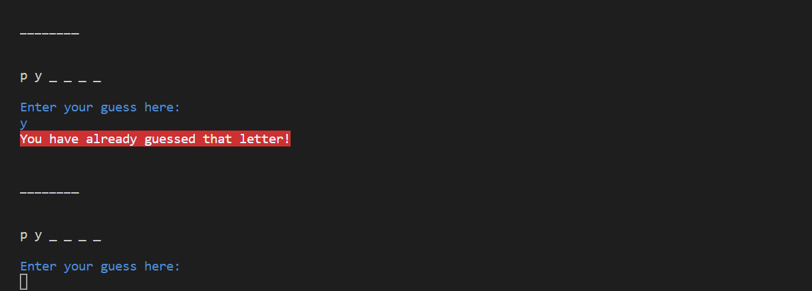

# Testing

Click to return back to the [README.md](README.md) file.

## Manual Testing

I have manually tested this project in my local terminal on GitPod and in the Code Institute Heroku terminal.

### Defensive Programming

In this project I have included code to ensure that any invalid or empty input while using the app and within gameplay is not accepted and an error message is shown to the user when their input is invalid:

  - Users cannot input numbers or special characters instead of letters throughout the game, whilst: 
    - Giving their name
    
    - Navigating the game menu options
    
    - Playing the game - users cannot input numbers or special characters, guess more than one letter at once or guess a letter they have already guessed)
    
    
    
    

    - Playing again
    

---

## Validator Testing

I have passed all my code from the below files through a PEP8 linter and confirmed there are no problems.

- [run.py file](https://pep8ci.herokuapp.com/https://raw.githubusercontent.com/katkapsasky/hangman/main/run.py)


- [easy.py file](https://pep8ci.herokuapp.com/https://raw.githubusercontent.com/katkapsasky/hangman/main/easy.py)


- [medium.py file]()


- [hard.py file](https://pep8ci.herokuapp.com/https://raw.githubusercontent.com/katkapsasky/hangman/main/hard.py)


- [hangman.py file](https://pep8ci.herokuapp.com/https://raw.githubusercontent.com/katkapsasky/hangman/main/hangman.py)


---

## Bugs

### Fixed Bugs

#### Guessing a letter you have already guessed

The input validation when a user guesses a letter they have already guessed was only working when they guessed a correct letter more than once - if the letter was incorrect the user could keep guessing and would run out of attempts. 

To fix this, I created an empty set to store user guesses,
``` self.used_words = set() ``` 
and then I added an if statement to check for guessed incorrect letters and an else statement to add and remember incorrect letters so the user will receive a message they have already guessed a letter whether it was correct or incorrect and an additional part of the hangman isn't drawn. 

``` # Check if a correct letter has already been guessed
            if user_input in self.progress:
                print(f"{Back.RED}You have already guessed that letter!")
                continue
            # Check if an incorrect letter has already been guessed
            if user_input in self.used_words:
                print(f"{Back.RED}You have already guessed that letter!")
                continue
            else:
                # Remember letters guessed by user
                self.used_words.add(user_input) 
```

#### Text formatting

Another bug I found was in text formatting. Some of the text printed to the console, such as the game rules, was throwing errors as the lines were too long and the text on the console was breaking so a new line would cut a word in half, making it hard for users to read. 

By formatting my text over multiple lines and adding in new lines I was able to make the text easier to read and fix the errors.

``` print(
                f"{Back.BLUE}Every wrong guess will result in "
                "part of the hangman being drawn. \n"
                "If you guess incorrectly 7 times, "
                " the hangman will be fully formed and you lose."
            )
```

#### Replay function after winning

The ```replay(self)``` function was not working correctly if a user won a game and after being asked to replay entered an invalid input. Instead of letting the user know their input was invalid and asking them to input "y" to replay or "n" to quit, again, as it should function, it would loop back to the word you just guessed and ask you to play again, even though the secret word would be visible. The code was written in the same way as for the replay option after losing a game, which does work correctly:


For the code to replay after winning a game to function correctly, I had to define the varibale ```user_replay``` and reformat my while statement so that as long as a user's input is invalid, no matter how many times it is invalid, and until they input "y" or "n", they receive an error message.


#### Using uppercase letters in inputs

I noticed that I hadn't used the ```lower()``` function for the difficulty level inputs or when guessing letters in the game. This meant that if a user input "EASY" as a difficulty level instead of "easy" they would receive an error saying the input was invalid. 

Similarly, when guessing letters in a secret word, if a guess was input as a capital letter, even if that letter was correct it would not show up in the game. To fix this, I add the ```lower()``` function so that the app will recognise upper and lowercase user inputs.


### Unfixed Bugs

There are no unfixed bugs that I am aware of.

---

